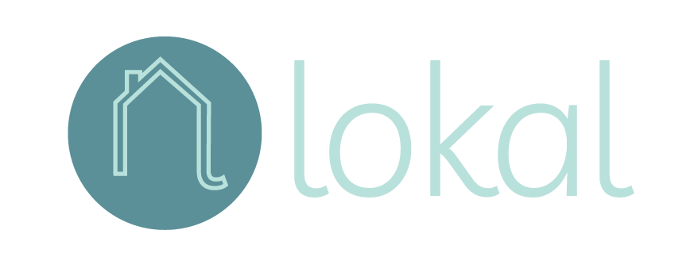

<p align="center">
</p>

<h2  align="center">
Lokal is a place where local businesses can easily create a web presence for themselves and be discovered by consumers who are looking for small businesses to support.
</h2>


## Collaborators: 
* [ColinJohnson747L](https://github.com/ColinJohnson747) | Backend Developer
* [Elliotmrgn](https://github.com/Elliotmrgn) | Front End Developer
* [lolo-bc](https://github.com/lolo-bc) | Front-End Developer
* [TiffanyCasey](https://github.com/TiffanyCasey) | Front-End Developer
* [samuelguevara98](https://github.com/samuelguevara98) | Backend Developer 


## The Problem 
As a consumer in recent times, it has become more glaringly obvious that finding information about small businesses can be difficult. Whether it's trying to find out if a restaurant was open for take out, or a certain location requires a face covering - google maps listings only show limited information and many small businesses don't have a full website. 

For a small business the only choices for how to get information to potential customers is to either have a website and the know-how to update it, a business page on facebook where information can be hard to find, or Yelp which has become cluttered and untrustworthy in it's reviews.

## The Solution

The idea of this application is to be a way to put local businesses and consumers in contact with one another simply and easily. For the small businesses, instead of having to learn how to create a website, they simply fill out a form when they sign up and quickly create a simple one listing page that they control. On their page, they are able to create a space that represents the company and its brand, and can convey the necessary information such as current up date to hours but as well as more detailed information about products and services. Creating a business page is as simple as filling out a form when you create an account. 

As a consumer, you can search tags and categories to find and support local businesses. The fully realized version of this site is a way to feature new business and updates from businesses, as well as discover what your community has to offer with keywords.  

## User Story
 ```
As a user, I want to have a convenient location with all my business information that I can quickly and easily update.  

As a user, I want to have one location where I can access up to date information for local businesses who may not have a website. 
```

## Technologies Used 

- Bootstrap 
- Adobe XD
- Adobe Photoshop 
- ReactJS
- Node.js
- MongoDB
- Robo 3T
- Firebase OTP
- Cloudinary
- Google Maps 
- EmailJS 
- Heroku 

## Updates to Future Deployments Include: 

- Develop a better way to verify users & their businesses
- Allow creators to have more control over their listing 
    -- Ex: unique URL, style customizations, layout templates, etc. 
- Enhance the map to show multiple listings at once 
- Add instaAPI to profile pages for more user interaction 
- Have user generated tags to increase categories and subcategories 
- Add the capability to search by zip code

## Deployed Site


